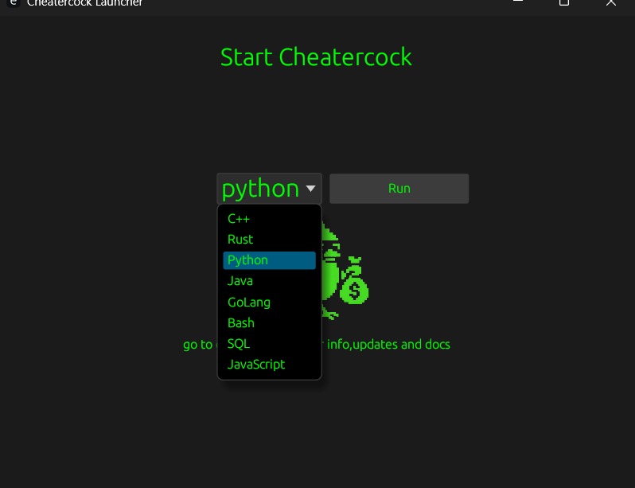
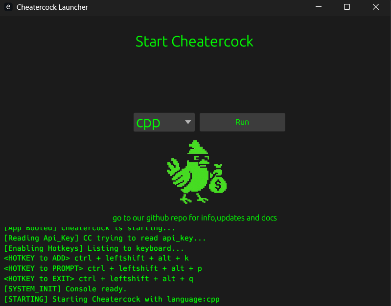
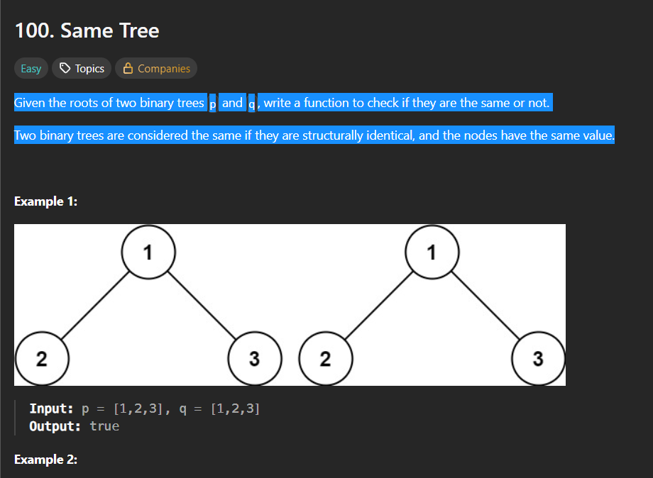
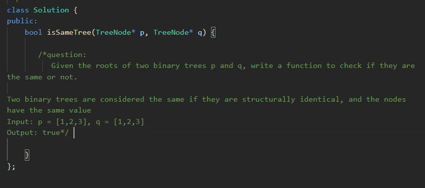
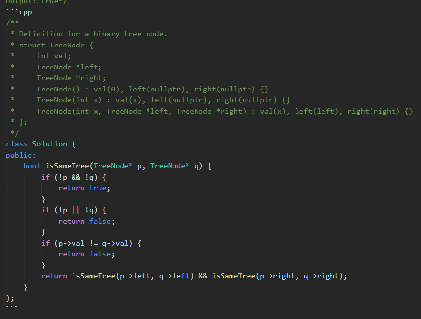
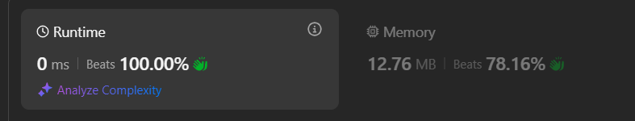

<!--
  A polished README for the CheaterCock project.
  Keep images in `ccreadme/` and assets in `assets/`.
-->

# CheaterCock — v1.1

Prompt LLMs from any app with global hotkeys — Copy → Press hotkey → Paste answer. No browser.


---

## TL;DR workflow (10 seconds)

1. Copy text you need help with.
1. Press Ctrl+Shift+Alt+K to send it to the LLM backend.
1. Press Ctrl+Shift+Alt+P to get the answer — it’s auto-copied; paste anywhere.

---

## Highlights

- Global hotkeys: send and retrieve prompts without context switching.
- Auto-clipboard: responses are ready to paste immediately.
- Runs in the background after first launch.
- Simple API key + language setup.

---

## Hotkeys (default)

- Send current snippet -> Ctrl+Shift+Alt+K
- Prompt saved question -> Ctrl+Shift+Alt+P

Tip: You can change hotkeys by editing the config file (`config.json`) or adding a small wrapper to remap keys on your system.

---

## About

Note — This software is for educational purposes to save time during competitions (where using AI is allowed). Never use it for academic malpractice or cheating in exams. The developers are not responsible for any misuse.

---

## How it works (workflow)

1. Copy the question or problem you want help with.
2. Paste it into the pre-coded snippet template (this helps produce consistent prompts).
3. Use the send-hotkey to transmit the prompt to the LLM backend.
4. Use the prompt-hotkey to fetch the stored prompt and the LLM will reply — the reply is automatically copied to your clipboard.

---

## Setup & Running

## 1. Download & run

<details>
<summary>Windows</summary>

1. Download **cheaterexe.zip** and unzip it.
2. Double-click `cheatercock.exe` (or run from PowerShell/CMD).

</details>

<details>
<summary>Linux</summary>

1. Unzip the release bundle:

```bash
unzip CheaterLinux.zip -d cheatercock-release
cd cheatercock-release
```

2. Make it executable and run:

```bash
chmod +x ./cheatercock
./cheatercock
```

</details>

---

## 2. Set API key

Set your API key when prompted. If you need an account, create one in Google AI Studio (or your chosen provider) and copy the key into the app when requested.

<p align="center">
  
</p>

---

## 3. Select language

When you run the app it will ask which language to use for prompts and replies. Choose the language you prefer.

<p align="center">
  
</p>

---

## 4. Background operation

After initial setup the app runs in the background. You can close the UI; the hotkey service will continue.

<p align="center">
  
</p>

---

## 5. Copy your question

Copy the text you want help with (for example, a coding problem or prompt).

<p align="center">
  
</p>

---

## 6. Insert into the snippet

Paste the copied text into the pre-coded snippet template so the LLM receives consistent context.

<p align="center">
  
</p>

---

## 7. Send to backend

Copy the entire snippet and press the send hotkey:

```
Ctrl + Shift + Alt + K
```

This uploads the prompt to the backend service for processing.

---

## 8. Retrieve the response

Press the prompt hotkey to fetch the saved prompt and get the LLM reply:

```
Ctrl + Shift + Alt + P
```

Responses typically appear in 10–20 seconds and are automatically copied to your clipboard. Paste the reply, extract the useful parts, and apply them as needed.

<p align="center">
  
</p>

---

## Tips

- Change hotkeys by editing `config.json` or use a system-level key remapper.
- If the response is slow or missing, ensure `cheatercock` is running and your API key is valid.
- Use the snippet template to keep prompts consistent for better results.

---

## Notes

Thanks for trying the project — star the repo if it helps. A future release with improved context handling is planned.

<p align="center">
  
</p>

---

## Troubleshooting

- No response after hotkey: Ensure `cheatercock` is running (check `ps aux | grep cheatercock`).
- API key rejected: Verify your key in the provider dashboard and re-enter it when asked.
- Permission denied running binary: Make the file executable: `chmod +x cheatercock`.

---

## Files of interest

- `src/` — application source (Rust)
- `config.json` — runtime configuration
- `cheaterexe.zip` — release bundle
- `ccreadme/` — screenshots used above

---

## Contributing

Small, focused contributions are welcome. Repo is written in Rust — prefer PRs that include a small test or brief documentation change. If you change hotkey behavior, add a short section to this README describing the change.

---
