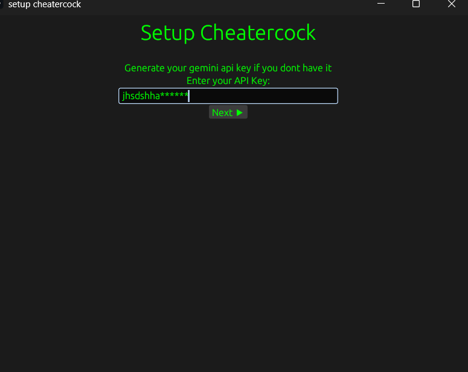

##1.Download cheaterexec.zip and unzip it
##2.Run cheatercock

#set api key if you don't have it

#run cheatercock again and it will ask for language

#cheater cock is running

you can now close the app...the logic has been fired and it will continue to run in background

##copy question

#put the question inside the precoded snippet so llm can understand better

##copy again entire problem and press ##ctrl+lshift+alt+k
this saves the copied text in backend

##press ctrl+lshift+alt+p to prompt llm with ur question and the response will be automatically pasted inside ur clipboard

llms dont usually send exact response use ur logic and keep what u need

##finally ur test cases r done without ever going to browser

#ctrl+lshift+alt+q to kill the program

